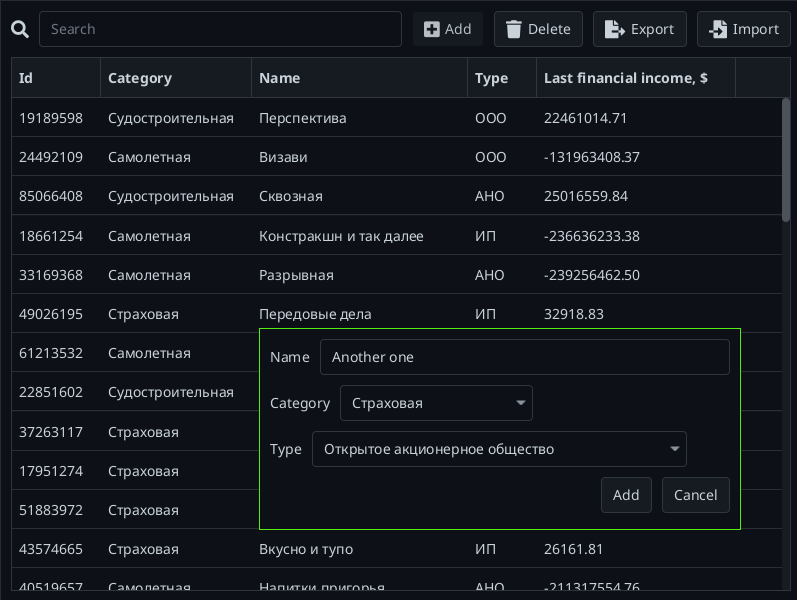

# Simple in-memory data manager
<div align="center">

</div>

# Features
- Export & import (.xlsx)
- Searching
- CRD operations

# Development

1. Download & extract [JavaFX](https://gluonhq.com/products/javafx/)

## Intellij Idea IDE

1. `Project Structure` > `Libraries` > `Add` > `/path/to/JavaFX/lib`
2. `Settings` > `Appearance & Behavior` > `Path Variables` > Create `PATH_TO_FX` with `/path/to/JavaFX/lib`
3. Edit `Application.main()` configuration > Edit VM Options > Add
```
--module-path /path/to/JavaFX/lib --add-modules=javafx.controls
```